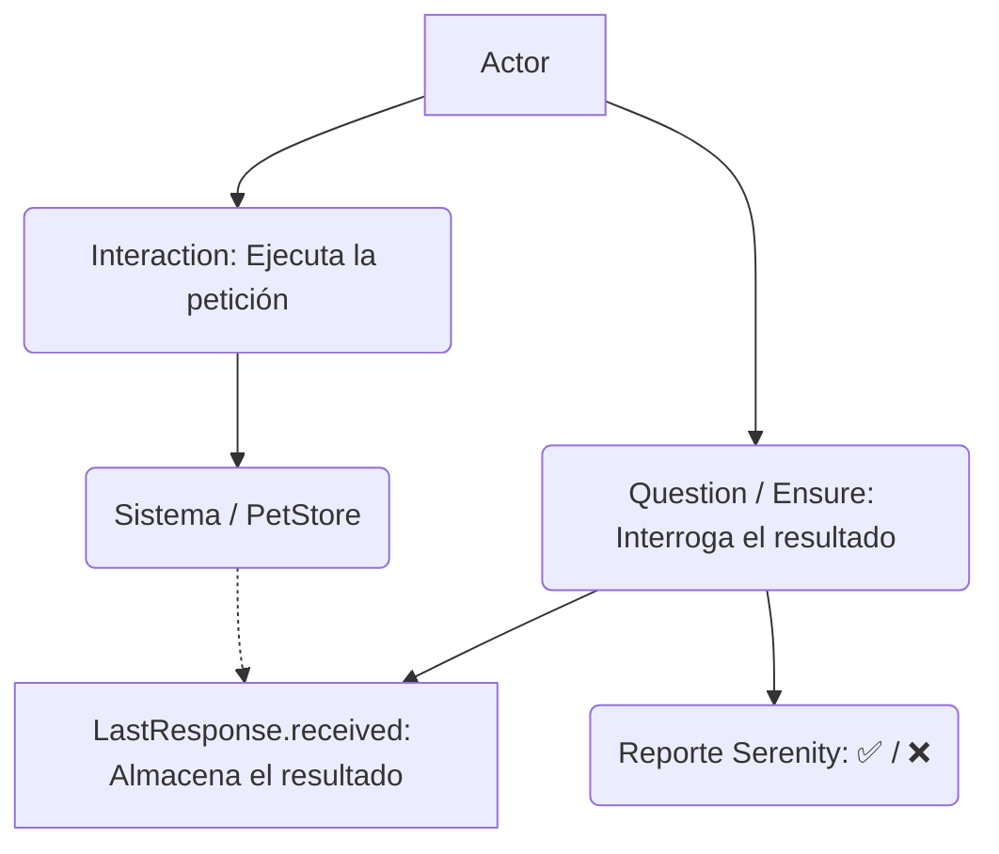

---

## description: 'Skill que especifica la arquitectura y buenas prácticas para la validación de respuestas REST (Aserciones) utilizando el Patrón Screenplay. Garantiza la separación estricta entre la ejecución (Tasks) y la verificación (Questions), validando códigos de estado, tiempos de respuesta, esquemas JSON y la integridad de los datos devueltos contra el modelo original.'

# Skill: api-assertion-expert [QA]

## Responsabilidad

Diseñar e implementar las Preguntas (`Questions`) y validaciones utilizando `Ensure` o `seeThat`. Su objetivo es interrogar el estado del sistema tras una interacción, inspeccionando `LastResponse.received()` para verificar de forma independiente que la API cumple con el contrato (esquema), los criterios de rendimiento (tiempos) y la integridad del negocio (los datos enviados coinciden con los guardados).

---

## ⚠️ REGLA ABSOLUTA — Separación de Aserciones

```
PROHIBIDO ABSOLUTAMENTE:
  - Incluir aserciones dentro de las Tareas (Tasks) o la capa de UI.
  - Utilizar `.then().statusCode(...)` encadenado directamente en la interacción `Post.to()` o `Get.resource()`.
  - Usar validaciones nativas de JUnit (`Assert.assertEquals`) directamente en los Steps en lugar de las aserciones de Screenplay que generan reportes legibles.

SIEMPRE usar:
  - Las construcciones `Ensure` de Serenity o `seeThat` para aserciones robustas.
  - El objeto `LastResponse.received()` para extraer el cuerpo, código de estado y cabeceras de la última petición ejecutada por el Actor.
  - Clases independientes en la capa `questions/` cuando la validación requiere lógica de extracción compleja.

```

---

## 1. Arquitectura de Validaciones (Questions)

En Screenplay, las aserciones son preguntas que el Actor le hace al sistema. Nunca se mezclan con la acción de preguntar.



---

## 2. Implementación Técnica (Caso PetStore)

### ❌ Código Anti-Patrón (Aserción Acoplada a la Tarea)

Viola el principio SRP al ejecutar la acción y validar el resultado en el mismo bloque de código.

```java
public class CrearUsuarioAcoplado implements Task {
    public <T extends Actor> void performAs(T actor) {
        // ❌ Acción y Aserción mezcladas, arruina la reutilización y el reporte
        SerenityRest.given()
            .body(usuarioPetStore)
            .post("/user")
            .then()
            .statusCode(200)
            .time(lessThan(2000L));
    }
}

```

### ✅ Enfoque Arquitectónico Screenplay (Aserciones Declarativas)

La Tarea se ejecuta por un lado, y las aserciones se realizan en el paso `Then` del Test utilizando `Ensure` para validar esquemas, tiempos, códigos e integridad de datos devueltos comparados con el POJO original.

```java
// 1. QUESTION: Extracción de datos para validación (si es necesario)
package uy.equipo6.petstore.questions;

import net.serenitybdd.rest.SerenityRest;
import net.serenitybdd.screenplay.Actor;
import net.serenitybdd.screenplay.Question;
import uy.equipo6.petstore.model.User;

public class UsuarioDevuelto implements Question<User> {
    public static Question<User> delCuerpoDeLaRespuesta() {
        return new UsuarioDevuelto();
    }

    @Override
    public User answeredBy(Actor actor) {
        // Extrae el JSON de la respuesta y lo mapea de vuelta al POJO original
        return SerenityRest.lastResponse().as(User.class);
    }
}

// 2. TEST ORQUESTADOR (Step Definition): Uso de Ensure y seeThat
package uy.equipo6.petstore.stepdefinitions;

import static net.serenitybdd.screenplay.GivenWhenThen.seeThat;
import static net.serenitybdd.screenplay.rest.questions.ResponseConsequence.seeThatResponse;
import static org.hamcrest.Matchers.equalTo;
import static org.hamcrest.Matchers.lessThanOrEqualTo;
import io.restassured.module.jsv.JsonSchemaValidator;

public class ValidacionSteps {

    // El POJO original que se envió en la petición POST/PUT
    User usuarioOriginal; 

    @Then("la respuesta es exitosa y los datos coinciden con el registro original")
    public void validarRespuestaExitosaEIntegridad() {
        actor.attemptsTo(
            // 1. Validar Código de Estado y Tiempo de Respuesta
            Ensure.that("el código de estado es 200", 
                response -> SerenityRest.lastResponse().statusCode() == 200),
            
            Ensure.that("el tiempo de respuesta es seguro", 
                time -> SerenityRest.lastResponse().time() <= 2000L),

            // 2. Validar Esquema JSON (Seguridad y Contrato)
            Ensure.that("el esquema JSON cumple con el contrato",
                schema -> SerenityRest.lastResponse().then().body(
                    JsonSchemaValidator.matchesJsonSchemaInClasspath("schemas/user_schema.json")
                )),

            // 3. Validar Integridad: El cuerpo devuelto coincide con lo enviado
            Ensure.that("el username coincide",
                res -> SerenityRest.lastResponse().jsonPath().getString("username").equals(usuarioOriginal.getUsername()))
        );
        
        // Alternativa usando seeThat y una Question personalizada para validar todo el objeto
        actor.should(
            seeThat("el usuario registrado", 
                UsuarioDevuelto.delCuerpoDeLaRespuesta(), equalTo(usuarioOriginal))
        );
    }
}

```

---

## 3. Riesgos a Mitigar

1. **Falsos Positivos en la Integridad:** Comparar objetos completos Java (`equalTo(usuarioOriginal)`) puede fallar si la API ignora campos nulos o inyecta IDs autogenerados. *Solución: Validar campos clave de negocio individualmente usando `jsonPath()` o ignorar los campos dinámicos (como el `id`) en el método `equals()` del POJO.*
2. **Caída por Tiempos Variables:** Las aserciones estrictas de tiempos de respuesta (`lessThan(500L)`) pueden causar tests intermitentes (flaky) en entornos de integración. *Solución: Usar un umbral generoso para automatización funcional y dejar las pruebas de estrés estricto para herramientas como JMeter.*

---

## Entregable: Estructura del Proyecto en el IDE

Las lógicas de verificación deben encapsularse en la carpeta `questions/` o implementarse directamente con `Ensure` en los `StepDefinitions`.

```text
├── src/main/java/uy/equipo6/petstore/
│   ├── model/                  
│   ├── tasks/                  
│   └── questions/              # 📍 AQUÍ VIVEN LAS CLASES DE EXTRACCIÓN Y VALIDACIÓN
│       └── UsuarioDevuelto.java
├── src/test/java/.../stepdefinitions/
│   └── ValidacionSteps.java    # 📍 AQUÍ SE ORQUESTAN LOS ENSURE / SEETHAT
└── src/test/resources/
    └── schemas/                
        └── user_schema.json    # 📍 AQUÍ VIVE EL ESQUEMA PARA VALIDACIÓN

```

---

## Proceso de Implementación

```
PASO 1 → En el Gherkin, definir el paso de validación (Ej. "Entonces al eliminarlo la respuesta es exitosa").
PASO 2 → En el Step Definition, acceder a la respuesta usando `SerenityRest.lastResponse()`.
PASO 3 → Utilizar `Ensure.that()` para asertar el `statusCode()` y el `time()`.
PASO 4 → Implementar la validación de `JsonSchemaValidator` guardando el contrato `.json` en `src/test/resources/schemas/`.
PASO 5 → Para validar integridad de datos, comparar el valor del `jsonPath()` devuelto con la propiedad del POJO original inyectado.

```

## Reporte

```
🛡️ API-ASSERTION-EXPERT [QA] — REPORTE DE ESTRUCTURA
══════════════════════════════════════════════════════
Aserciones separadas de Tasks:   ✅
Uso de Ensure / seeThat:         ✅
Validación de Status Code:       X
Validación de Tiempos:           X
Validación de Esquema JSON:      X
Validación de Integridad (Body): X

Estado del Patrón: [IMPLEMENTADO | EN DESARROLLO]
══════════════════════════════════════════════════════

```

---
