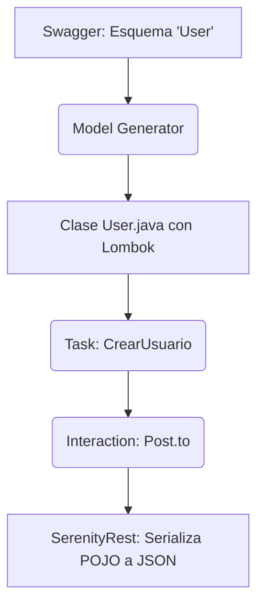

---

## description: 'Skill que especifica la arquitectura y buenas prácticas para la creación de POJOs (Plain Old Java Objects) utilizando Lombok. Garantiza la correcta serialización y deserialización de cuerpos JSON para peticiones REST (POST, PUT) y validación de respuestas, manteniendo el código libre de strings JSON hardcodeados.'

# Skill: model-generator [QA]

## Responsabilidad

Diseñar e implementar las clases de datos y entidades del sistema basadas en los esquemas de la documentación de la API (Swagger/OpenAPI). Utilizar la librería Lombok para reducir el código repetitivo (boilerplate) y habilitar el patrón Builder, permitiendo a las Tareas (Tasks) instanciar objetos de prueba de forma fluida y legible para su posterior envío en las peticiones HTTP.

---

## ⚠️ REGLA ABSOLUTA — Generación de Modelos de Datos

```
PROHIBIDO ABSOLUTAMENTE:
  - Construir cuerpos JSON concatenando Strings manualmente (ej. `"{\"username\":\"" + user + "\"}"`).
  - Escribir constructores, Getters y Setters manualmente (violación de limpieza de código cuando se dispone de Lombok).
  - Incluir lógica de negocio, aserciones o localizadores dentro de las clases del modelo.

SIEMPRE usar:
  - Anotaciones de Lombok: `@Data`, `@Builder`, `@NoArgsConstructor` y `@AllArgsConstructor` para crear POJOs/Lombok para serializar/deserializar cuerpos JSON.
  - Tipos de datos coherentes con el contrato Swagger (ej. `Long` para IDs numéricos grandes, `String` para textos).
  - Anotaciones de la librería de mapeo (ej. Jackson `@JsonIgnoreProperties(ignoreUnknown = true)`) para evitar fallos si la API devuelve campos no mapeados.

```

---

## 1. Arquitectura de Mapeo de Modelos (POJOs)

En la arquitectura Screenplay, los modelos actúan como el medio de transporte de la información. Representan el estado o los datos que un Actor envía al sistema o recibe de él.



---

## 2. Implementación Técnica (Caso PetStore - Entidad User)

### ❌ Código Anti-Patrón (JSON Hardcodeado)

Es frágil, difícil de mantener y propenso a errores de sintaxis (comillas faltantes, tipos de datos incorrectos).

```java
public class CrearUsuario implements Task {
    public <T extends Actor> void performAs(T actor) {
        String jsonBody = "{ \"id\": 1, \"username\": \"equipo6QA\", \"email\": \"qa@test.com\" }";
        
        SerenityRest.given()
            .header("Content-Type", "application/json")
            .body(jsonBody)
            .post("/user");
    }
}

```

### ✅ Enfoque Arquitectónico Screenplay (Lombok + Patrón Builder)

Se crea un modelo limpio en la capa correspondiente y se instancia usando un `Builder` semántico.

```java
// 1. MODELO: Entidad aislada en el paquete 'model'
package uy.equipo6.petstore.model;

import lombok.AllArgsConstructor;
import lombok.Builder;
import lombok.Data;
import lombok.NoArgsConstructor;

@Data
@Builder
@NoArgsConstructor
@AllArgsConstructor
public class User {
    private Long id;
    private String username;
    private String firstName;
    private String lastName;
    private String email;
    private String password;
    private String phone;
    private Integer userStatus;
}

// 2. TASK: Uso del modelo con inyección limpia
package uy.equipo6.petstore.tasks;

import uy.equipo6.petstore.model.User;
import static uy.equipo6.petstore.utils.endpoints.PetStoreEndpoints.CREATE_USER;

public class CrearUsuario implements Task {
    private final User usuarioPetStore;

    public CrearUsuario(User usuarioPetStore) {
        this.usuarioPetStore = usuarioPetStore;
    }

    @Step("{0} crea un nuevo usuario con username #usuarioPetStore.username")
    public <T extends Actor> void performAs(T actor) {
        actor.attemptsTo(
            Post.to(CREATE_USER.path())
                .with(request -> request
                    .header("Content-Type", "application/json")
                    .body(usuarioPetStore) // SerenityRest serializa el objeto automáticamente
                )
        );
    }
}

```

---

## 3. Riesgos a Mitigar

1. **Fallos de Deserialización por Constructores Faltantes:** Librerías como Jackson necesitan un constructor vacío para instanciar el objeto al leer un JSON de respuesta. *Solución: Siempre incluir `@NoArgsConstructor` junto a `@Builder`.*
2. **Cambios de Contrato Silenciosos:** Si la API agrega un campo nuevo que no está en el POJO, la prueba puede fallar inesperadamente al leer la respuesta. *Solución: Anotar la clase con `@JsonIgnoreProperties(ignoreUnknown = true)` si solo nos importan campos específicos para la validación.*

---

## Entregable: Estructura del Proyecto en el IDE

Este componente debe ubicarse estrictamente en la carpeta `model/`, aislando completamente la estructura de datos de las acciones de prueba.

```text
├── src/main/java/uy/equipo6/petstore/
│   ├── tasks/                  
│   ├── utils/endpoints/        
│   └── model/                  # 📍 AQUÍ VIVEN LOS POJOS
│       └── User.java           # Generado a partir del Swagger de PetStore
└── build.gradle                # Debe incluir las dependencias de Lombok y Jackson/Gson

```

---

## Proceso de Implementación

```
PASO 1 → Inspeccionar el tab "Models" o "Schemas" en Swagger (ej. esquema de `User`).
PASO 2 → Crear la clase Java con el mismo nombre de la entidad en el paquete `model/`.
PASO 3 → Declarar los atributos privados respetando los tipos de datos (int, string, array).
PASO 4 → Decorar la clase con las anotaciones de Lombok (`@Data`, `@Builder`, etc.).
PASO 5 → Desde el Test o la Tarea, instanciar la data usando `User.builder().username("...").build()`.
PASO 6 → Pasar el objeto al método `.body()` de SerenityRest.

```

## Reporte

```
📦 MODEL-GENERATOR [QA] — REPORTE DE ESTRUCTURA
══════════════════════════════════════════════════
Esquemas (Swagger) transformados: [ ] SÍ / [ ] NO
Dependencia Lombok configurada:   ✅
Anotaciones base aplicadas:       ✅
Patrón Builder implementado:      X
Ausencia de Strings JSON manuales:X

Estado del Patrón: [IMPLEMENTADO | EN DESARROLLO]
══════════════════════════════════════════════════

```

---
