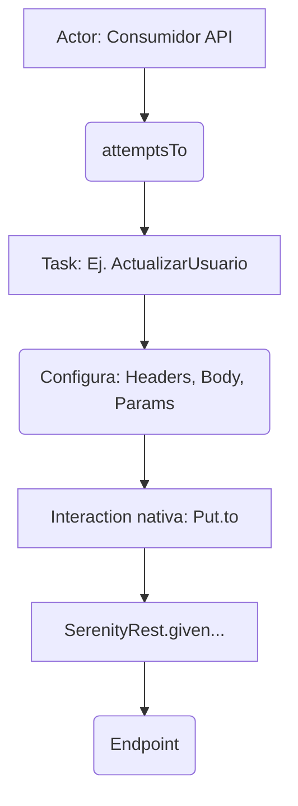

---

## description: 'Skill que especifica la arquitectura y buenas prácticas para diseñar Interacciones y Tareas REST utilizando Serenity BDD. Define cómo orquestar peticiones HTTP encapsulando la configuración de SerenityRest de forma declarativa, separándola del flujo de negocio en el Patrón Screenplay.'

# Skill: rest-interaction-designer [QA]

## Responsabilidad

Diseñar e implementar las Tareas (Tasks) que orquestan las llamadas a la API utilizando las interacciones nativas de Serenity BDD (`Post.to()`, `Get.resource()`, `Put.to()`, `Delete.from()`). El objetivo es encapsular la complejidad técnica de la petición HTTP para que el paso en Gherkin (ej. "Cuando consulto sus datos") se traduzca en código Java fluido y auto-documentado, delegando el ensamblaje de la petición a `SerenityRest.given()`.

---

## ⚠️ REGLA ABSOLUTA — Orquestación de Peticiones REST

```
PROHIBIDO ABSOLUTAMENTE:
  - Incluir aserciones (validaciones de status code, schemas o body) dentro de la Tarea que realiza la petición.
  - Mezclar responsabilidades: quemar endpoints, crear JSON manuales y hacer la petición, todo en el mismo método `performAs`.
  - Utilizar `RestAssured.given()` puro directamente, ya que rompe la trazabilidad del reporte HTML generado por Serenity.

SIEMPRE usar:
  - Las clases de interacción nativas de Serenity: `Get.resource()`, `Post.to()`, `Put.to()`, `Delete.from()`.
  - La interfaz `Task` de Screenplay para orquestar la preparación (Headers, Body desde el POJO, Path Params) de la llamada.
  - Inyección de dependencias (vía constructor o métodos estáticos de fábrica) para pasar la data necesaria a la Tarea.

```

---

## 1. Arquitectura de Orquestación REST

En Screenplay, el Actor no interactúa con la red directamente. El Actor "intenta" (attemptsTo) realizar una Tarea de negocio, la cual a su vez configura y ejecuta una Interacción técnica de bajo nivel contra el endpoint.



---

## 2. Implementación Técnica (Caso PetStore)

### ❌ Código Anti-Patrón (Espagueti Técnico y Aserciones Mezcladas)

Viola el SRP (Single Responsibility Principle) al tener múltiples responsabilidades en una sola clase (crear datos, localizar endpoint, ejecutar y asertar).

```java
public class ActualizarUsuarioAntiPattern implements Task {
    public <T extends Actor> void performAs(T actor) {
        // ❌ Mezcla lógica técnica, body hardcodeado, endpoints quemados y aserciones
        SerenityRest.given()
            .header("Content-Type", "application/json")
            .body("{ \"username\": \"QA\", \"email\": \"qa@test.com\" }")
            .when()
            .put("/user/QA")
            .then()
            .statusCode(200); // ❌ Las aserciones NO van en la Tarea
    }
}

```

### ✅ Enfoque Arquitectónico Screenplay (Orquestación Limpia)

La Tarea SOLO orquesta la tarea. Recibe el POJO generado por `/model-generator`, usa las constantes del `/api-resource-mapper` y delega la ejecución a las interacciones de Serenity.

```java
package uy.equipo6.petstore.tasks;

import net.serenitybdd.screenplay.Actor;
import net.serenitybdd.screenplay.Task;
import net.serenitybdd.screenplay.Tasks;
import net.serenitybdd.screenplay.rest.interactions.Put;
import net.thucydides.core.annotations.Step;
import uy.equipo6.petstore.model.User;
import static uy.equipo6.petstore.utils.endpoints.PetStoreEndpoints.USER_OPERATIONS;

public class ActualizarUsuario implements Task {

    private final String usernamePath;
    private final User datosActualizados;

    public ActualizarUsuario(String usernamePath, User datosActualizados) {
        this.usernamePath = usernamePath;
        this.datosActualizados = datosActualizados;
    }

    // Método estático de fábrica para sintaxis fluida en el test
    public static ActualizarUsuario conDatos(String usernamePath, User datos) {
        return Tasks.instrumented(ActualizarUsuario.class, usernamePath, datos);
    }

    // ✅ Documentación automática en el reporte de Serenity
    @Step("{0} actualiza los datos del usuario #usernamePath") 
    @Override
    public <T extends Actor> void performAs(T actor) {
        actor.attemptsTo(
            // ✅ Uso de Interacciones nativas
            Put.to(USER_OPERATIONS.path())
               .with(request -> request
                   .pathParam("username", usernamePath)
                   .header("Content-Type", "application/json")
                   .body(datosActualizados) // El POJO se serializa aquí
               )
        );
    }
}

```

---

## 3. Riesgos a Mitigar

1. **Pérdida de Trazabilidad en Reportes:** Utilizar métodos de `RestAssured` que no pasen por el filtro de Screenplay hace que el detalle de la petición y respuesta desaparezca del reporte final (`clean test aggregate`). *Solución: Siempre importar desde `net.serenitybdd.screenplay.rest.interactions.*`.*
2. **Sobrecarga de la Tarea con Transformaciones:** Poner lógica compleja de manipulación de fechas, strings o cálculos matemáticos justo antes de enviar el `.body()`. *Solución: Toda lógica de preparación de datos debe ocurrir en la construcción del POJO (en el step anterior) o a través de Builders, no ensuciar el método `performAs`.*

---

## Entregable: Estructura del Proyecto en el IDE

Las tareas de negocio de alto nivel residen exclusivamente en su capa designada (`tasks/`), orquestando las dependencias externas.

```text
├── src/main/java/uy/equipo6/petstore/
│   ├── model/                  # Entidades inyectadas en la Task
│   ├── utils/endpoints/        # Constantes mapeadas consumidas por la Task
│   └── tasks/                  # 📍 AQUÍ VIVEN LAS TASKS QUE ORQUESTAN API
│       ├── CrearUsuario.java
│       ├── ConsultarUsuario.java
│       └── ActualizarUsuario.java
└── src/test/java/...           # Aquí el Gherkin llamará a estas tareas

```

---

## Proceso de Implementación

```
PASO 1 → Identificar la acción de negocio y crear la clase implementando la interfaz `Task` en el paquete `tasks/`.
PASO 2 → Definir los campos `private final` y el constructor para recibir el contexto (POJOs para el body, Strings para Path Params).
PASO 3 → Implementar un método estático de fábrica (ej. `public static ActualizarUsuario conDatos(...)`) para facilitar la lectura en el Test.
PASO 4 → Sobrescribir `performAs(Actor actor)` y decorarlo con `@Step`.
PASO 5 → Dentro de `attemptsTo()`, instanciar la interacción HTTP correcta (`Post.to`, `Get.resource`, etc.).
PASO 6 → Configurar los detalles técnicos mediante la función lambda `.with(request -> request...)` agregando headers y body.

```

## Reporte

```
⚙️ REST-INTERACTION-DESIGNER [QA] — REPORTE DE ESTRUCTURA
═════════════════════════════════════════════════════════
Interfaz Task implementada:      ✅
Uso nativo de interacciones:     X (Post, Get, Put, Delete)
Aserciones aisladas (Ausentes):  ✅
Data inyectada (No hardcodeada): ✅
Anotación @Step configurada:     X

Estado del Patrón: [IMPLEMENTADO | EN DESARROLLO]
═════════════════════════════════════════════════════════

```

---
