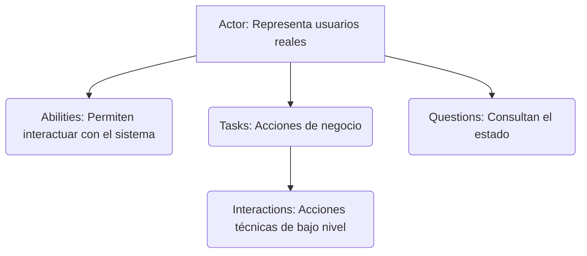

---

## description: 'Skill que especifica la arquitectura, reglas y buenas prácticas para la implementación del Patrón Screenplay, garantizando pruebas automatizadas escalables, centradas en el comportamiento del usuario y estrictamente alineadas con los principios SOLID.'

# Skill: screenplay-pattern [QA]

## Responsabilidad

Diseñar, implementar y mantener la arquitectura de las pruebas automatizadas utilizando el Patrón Screenplay. El objetivo es modelar actores que realizan tareas para alcanzar objetivos , separando radicalmente las responsabilidades técnicas (localizadores, interacciones) de las de negocio (tareas, preguntas).

---

## ⚠️ REGLA ABSOLUTA — Separación de Responsabilidades

```
PROHIBIDO ABSOLUTAMENTE:
  - [cite_start]Crear "Large Classes" o "God Objects" que mezclen localizadores, lógica de negocio y aserciones en un solo lugar[cite: 49, 53].
  - [cite_start]Modificar clases existentes para agregar nueva funcionalidad (violación de Open/Closed)[cite: 54, 420].
  - [cite_start]Utilizar herencia compleja para compartir flujos de prueba[cite: 66, 73].
  - Incluir aserciones dentro de las Tareas (Tasks) o la capa de UI.

SIEMPRE usar:
  - [cite_start]Composición sobre herencia[cite: 73].
  - [cite_start]Clases pequeñas, independientes y con UNA sola responsabilidad (SRP)[cite: 68, 118, 417].
  - [cite_start]Localizadores (Targets) aislados completamente en la capa UI[cite: 151].
  - [cite_start]Abstracciones (Performable, Question) en lugar de implementaciones concretas (DIP)[cite: 428].

```

---

## 1. Arquitectura y Estructura del Patrón

A diferencia del enfoque tradicional centrado en páginas de la UI , Screenplay es un patrón de diseño para automatización de pruebas de aceptación que aplica principios SOLID. Está centrado en actores y sus objetivos.

El "screen" no se refiere a la pantalla del computador, sino al guion teatral. Cada test se escribe como un pequeño guion. Para visualizar y documentar este flujo en tu repositorio, resulta muy útil modelar la interacción mediante diagramas de Mermaid:



*
**Actors:** Tienen nombres y habilidades.


*
**Abilities:** Lo que permite al actor interactuar (ej. navegar en la web, consumir APIs).


*
**Tasks:** Acciones de alto nivel de negocio ("Iniciar sesión", "Resolver ticket").


*
**Interactions:** Acciones técnicas de bajo nivel (Click, Type, Scroll).


*
**Questions:** Consultan el estado actual del sistema ("¿Qué texto tiene este campo?").


---

## 2. La Estructura de un Buen Screenplay (SOLID en Acción)

El patrón Screenplay brilla por su alineación natural con los principios SOLID.

* **S - Single Responsibility:** 1 clase = 1 responsabilidad. La capa UI *solo* tiene localizadores, la Task *solo* orquesta.


* **O - Open/Closed:** Para agregar una funcionalidad en `SistemaTickets`, simplemente creas una nueva clase `Task`. No modificas el código existente.


*
**L - Liskov Substitution:** Cualquier Task puede ejecutarse por cualquier Actor que tenga las Abilities requeridas.


*
**I - Interface Segregation:** Se utilizan interfaces pequeñas y específicas (`Task`, `Question`, `Interaction`).


*
**D - Dependency Inversion:** Las Tasks dependen de abstracciones en lugar de implementaciones concretas.


---

## 3. Comparativa Técnica

### ❌ Código POM - "Espagueti de Responsabilidades"

Viola el principio SRP al tener 4 responsabilidades en una sola clase (localizar, ejecutar, verificar, navegar).

```java
public class LoginPage extends PageObject {
    [cite_start]// Responsabilidad 1: LOCALIZAR ELEMENTOS [cite: 77]
    [cite_start]@FindBy(id = "email") WebElement emailField; [cite: 78]
    [cite_start]@FindBy(id = "password") WebElement passwordField; [cite: 79]
    [cite_start]@FindBy(id = "submit") WebElement submitButton; [cite: 80]

    [cite_start]// Responsabilidad 2: Ejecutar acciones [cite: 85]
    [cite_start]public void loginAs(String email, String pass) { [cite: 81]
        [cite_start]emailField.sendKeys(email); [cite: 83]
        [cite_start]submitButton.click(); [cite: 84]
    }

    [cite_start]// Responsabilidad 3: Verificar estado [cite: 89]
    [cite_start]public String getWelcomeMessage() { [cite: 86]
        [cite_start]return driver.findElement(By.id("welcome")).getText(); [cite: 88]
    }
[cite_start]} [cite: 93]

```

### ✅ Enfoque Arquitectónico Screenplay

Separa localizadores, tareas e interacciones, favoreciendo la reutilización. El test se lee en lenguaje natural.

```java
[cite_start]// 1. UI: SOLO localizadores (Targets) [cite: 96, 151]
public class SistemaTicketsUI {
    [cite_start]public static final Target EMAIL = Target.the("email").locatedBy("#email"); [cite: 99, 100, 101]
    [cite_start]public static final Target SUBMIT = Target.the("submit btn").locatedBy("#submit"); [cite: 105, 106, 107]
}

[cite_start]// 2. TASK: SOLO orquesta la tarea [cite: 109]
public class Autenticarse implements Task {
    private final String email;
    // ... constructor ...

    [cite_start]@Step("{0} inicia sesión en el sistema") [cite: 113]
    [cite_start]public <T extends Actor> void performAs(T actor) { [cite: 113]
        [cite_start]actor.attemptsTo( [cite: 113]
            [cite_start]Enter.theValue(email).into(SistemaTicketsUI.EMAIL), [cite: 114, 115]
            [cite_start]Click.on(SistemaTicketsUI.SUBMIT) [cite: 117]
        );
    }
}

[cite_start]// 3. TEST: Orquestación del Actor [cite: 120]
[cite_start]givenThat(analista).wasAbleTo(Open.browserOn().the(new LoginPage())); [cite: 121]
when(analista).attemptsTo(Autenticarse.conCredenciales("equipo6@test.com")); 
[cite_start]then(analista).should(seeThat(MensajeBienvenida.desplegado(), equalTo("Panel de Tickets"))); [cite: 123]

```

---

## 4. Riesgos a Mitigar (Consideraciones Adicionales)

1. **Proliferación de Clases:** Como cada acción y pregunta es una clase independiente, el repositorio puede desordenarse rápidamente. *Solución: Mantener una estricta jerarquía de carpetas por dominio de negocio dentro de `tasks/` y `questions/`.*
2. **Sobrecarga Técnica en Tests:** Evitar nombrar las Tasks como acciones mecánicas (ej. `HacerClickYLlenarFormulario`). *Solución: Las Tasks deben nombrar intenciones de negocio, como `CrearUnNuevoTicket` o `AsignarPrioridad`.*
3.
**Configuración Dispersa:** Solución: Centralizar la configuración de entornos y drivers en el archivo `serenity.conf` (formato HOCON), el cual tiene prioridad y es jerárquico, superando las limitaciones de un `.properties` plano.


---

## Entregable: Estructura del Proyecto en el IDE

El framework debe reflejar exactamente la siguiente jerarquía para garantizar el aislamiento:

```text
├── src/main/java/.../screenplay/
[cite_start]│   ├── tasks/                  # Tareas de negocio de alto nivel (ej. Login.java) [cite: 144, 145]
[cite_start]│   ├── interactions/           # Interacciones atómicas y reutilizables con la UI [cite: 146, 147]
[cite_start]│   ├── questions/              # Consultas al estado del sistema / Verificaciones [cite: 148, 149]
[cite_start]│   ├── ui/                     # SOLO localizadores (Targets), sin lógica [cite: 150, 151]
[cite_start]│   └── model/                  # Clases de datos y entidades del sistema [cite: 152, 153]
[cite_start]├── src/test/java/.../features/ # Tests reales ejecutados con JUnit o Cucumber [cite: 154, 155]
└── src/test/resources/
    [cite_start]├── serenity.conf           # Configuración principal (driver, URLs, screenshots) [cite: 156, 157]
    [cite_start]└── features/               # Archivos .feature (Gherkin) [cite: 339]

```

---

## Proceso de Implementación

```
PASO 1 → Identificar los Actores y las Abilities que necesitarán (ej. BrowseTheWeb).
[cite_start]PASO 2 → Mapear la interfaz de usuario creando clases en `ui/` con los `Target` correspondientes[cite: 150].
[cite_start]PASO 3 → Construir `Questions` para validar los estados que el Actor necesita observar[cite: 224].
[cite_start]PASO 4 → Crear `Interactions` personalizadas solo si las nativas de Serenity no cubren una acción atómica muy específica[cite: 208, 209].
[cite_start]PASO 5 → Desarrollar las `Tasks` componiendo múltiples Interactions o Tasks más pequeñas[cite: 144].
[cite_start]PASO 6 → Escribir los Casos de Prueba (Features/Tests) instanciando al Actor y pasándole las Tasks mediante `attemptsTo()`[cite: 113, 122].

```

## Reporte

```
🎭 SCREENPLAY-PATTERN [QA] — REPORTE DE ESTRUCTURA
══════════════════════════════════════════════════
Actores y Abilities definidos:   [ ] SÍ / [ ] NO
Capa UI (Targets aislados):      X
Tasks de negocio creadas:        X
Questions implementadas:         X

Validaciones arquitectónicas:
  1 Clase = 1 Responsabilidad:   ✅
  Ausencia de lógicas en UI:     ✅
  Configuración en serenity.conf:✅

Estado del Patrón: [IMPLEMENTADO | EN MIGRACIÓN]
══════════════════════════════════════════════════

```

---
