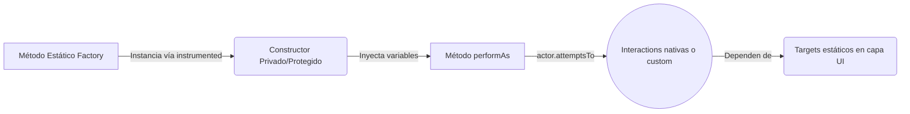

---

## description: 'Skill de bajo nivel responsable de la generación, estructuración y codificación estricta de clases Task en Serenity BDD, asegurando la inyección de dependencias, el uso de @Step y la orquestación de interacciones.'

# Skill: task-creator [QA]

## Responsabilidad

Escribir el código Java específico para automatizar una acción de negocio (Task) en el patrón Screenplay. Este skill actúa como el desarrollador táctico que traduce un requerimiento o paso de Gherkin en una clase modular que el Actor pueda ejecutar mediante `attemptsTo()`, manteniendo las aserciones y los localizadores estrictamente fuera de esta capa.

---

## ⚠️ REGLA ABSOLUTA — Sintaxis y Construcción de la Tarea

```
PROHIBIDO ABSOLUTAMENTE:
  - Instanciar, definir o buscar `Target` (localizadores) dentro de la clase Task. Siempre deben importarse de la capa estática `ui/`.
  - Incluir lógica de validación (Questions o asserts) dentro de la Task.
  - Usar el constructor por defecto (public) para la instanciación directa en los tests.

SIEMPRE usar:
  - La anotación `@Step("{0} realiza la acción descriptiva")` en el método `performAs()` para garantizar un reporte limpio.
  - El método estático factory (ej. `public static Task conDatos(...)`) que retorne `Tasks.instrumented(MiTarea.class, parametros)`.
  - Nombres de clase que representen intenciones de negocio claras y verbos de acción (ej. `AsignarPrioridad`, no `ClickEnBotonYSeleccionar`).

```

---

## 1. Anatomía de una Task Perfecta

Una Task es puramente orquestacional. Simplemente toma el Actor (que posee las Abilities necesarias) y le dicta qué secuencia de `Interactions` (o sub-tareas) debe ejecutar sobre la interfaz.

Para visualizar cómo debe construirse y exponerse la clase dentro del repositorio:



---

## 2. Plantilla de Código Estándar (Ejemplo Práctico)

Todo código generado por este skill debe estar listo para ser insertado directamente en tu entorno (como VS Code) sin requerir refactorizaciones adicionales. A continuación, el estándar de codificación esperado para los módulos de `SistemaTickets` mantenidos por el Equipo 6:

```java
package com.equipo6.sistematickets.screenplay.tasks;

import com.equipo6.sistematickets.screenplay.ui.DetalleTicketUI;
import net.serenitybdd.screenplay.Actor;
import net.serenitybdd.screenplay.Task;
import net.serenitybdd.screenplay.Tasks;
import net.serenitybdd.screenplay.actions.Click;
import net.serenitybdd.screenplay.actions.Enter;
import net.thucydides.core.annotations.Step;

public class AsignarPrioridad implements Task {

    private final String nivelPrioridad;

    // 1. Constructor protegido para forzar el uso del Factory
    protected AsignarPrioridad(String nivelPrioridad) {
        this.nivelPrioridad = nivelPrioridad;
    }

    // 2. Método estático Factory (Estándar Serenity para inyección en el reporte)
    public static AsignarPrioridad alta() {
        return Tasks.instrumented(AsignarPrioridad.class, "Alta");
    }

    public static AsignarPrioridad conNivel(String nivel) {
        return Tasks.instrumented(AsignarPrioridad.class, nivel);
    }

    // 3. Orquestación con @Step claro para el reporte vivo
    @Step("{0} asigna la prioridad '#nivelPrioridad' al ticket actual")
    @Override
    public <T extends Actor> void performAs(T actor) {
        actor.attemptsTo(
            Click.on(DetalleTicketUI.DROPDOWN_PRIORIDAD),
            Enter.theValue(nivelPrioridad).into(DetalleTicketUI.INPUT_BUSQUEDA_PRIORIDAD),
            Click.on(DetalleTicketUI.OPCION_RESULTADO)
        );
    }
}

```

---

## Entregable: Formato de Respuesta del Agente

Al invocar a este skill, la salida debe componerse estrictamente de la clase Java solicitada y un breve reporte de validación.

```text
├── src/main/java/.../screenplay/tasks/
│   └── [NombreDeLaTarea].java  # Código completo listo para revisión

```

## Reporte de Creación

```
🛠️ TASK-CREATOR [QA] — VALIDACIÓN DE CÓDIGO
══════════════════════════════════════════════════
Clase Generada:          [NombreDeLaClase]
Método Factory estático: ✅
Anotación @Step:         ✅
Ausencia de Assertions:  ✅
Targets importados (UI): ✅
══════════════════════════════════════════════════

```

---