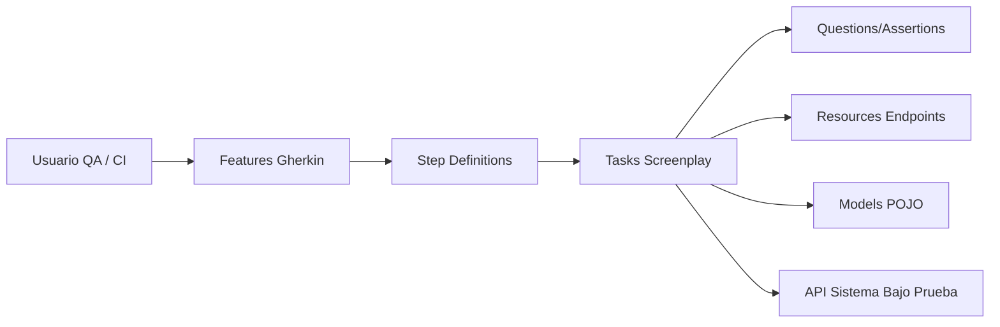

# AUTO_API_PETSTORE_SCREENPLAY

## Vista general de arquitectura

Este proyecto está orientado a **automatización de pruebas API** con **Gradle + Java + Serenity BDD (Screenplay)**.  
La arquitectura documentada abajo combina:

1. **Arquitectura real del codebase de pruebas** (features, steps, tasks, questions, models, resources).

---

## Diagrama general (componentes + usuarios + base de datos)



---


## Dependencias y frameworks clave

| Componente / Framework | Rol principal | Estado en este codebase |
|---|---|---|
| Gradle | Build, ejecución de pruebas y tareas (`test`, `aggregate`) | ✅ Detectado |
| Java | Lenguaje base del proyecto | ✅ Detectado |
| Serenity BDD | Reportería y ejecución bajo patrón Screenplay | ✅ Detectado |
| Cucumber (Gherkin) | Definición BDD de escenarios | ✅ Detectado |
| Rest Assured / SerenityRest | Interacción y validación de APIs REST | ✅ Esperado por arquitectura |

---

## Flujo de ejecución (alto nivel)

1. Se define comportamiento en **Gherkin**.
2. `Step Definitions` traducen pasos a acciones reutilizables.
3. `Tasks` ejecutan llamadas API (POST/GET/PUT/DELETE).
4. `Questions` validan status code, payload y reglas esperadas.
5. Serenity genera reporte consolidado (`gradle clean test aggregate`).

---

## Ejecución y reporte Serenity

1. Verifica Java:
```bash
java -version
```

2. Genera pruebas + reporte:
```bash
./gradlew clean test aggregate
```

3. Abre el reporte:
```bash
./gradle serenityReport
```

4. Alternativa rápida:
- Windows:
```bat
open-serenity-report.bat
```
- Git Bash:
```bash
bash ./open-serenity-report.sh
```
