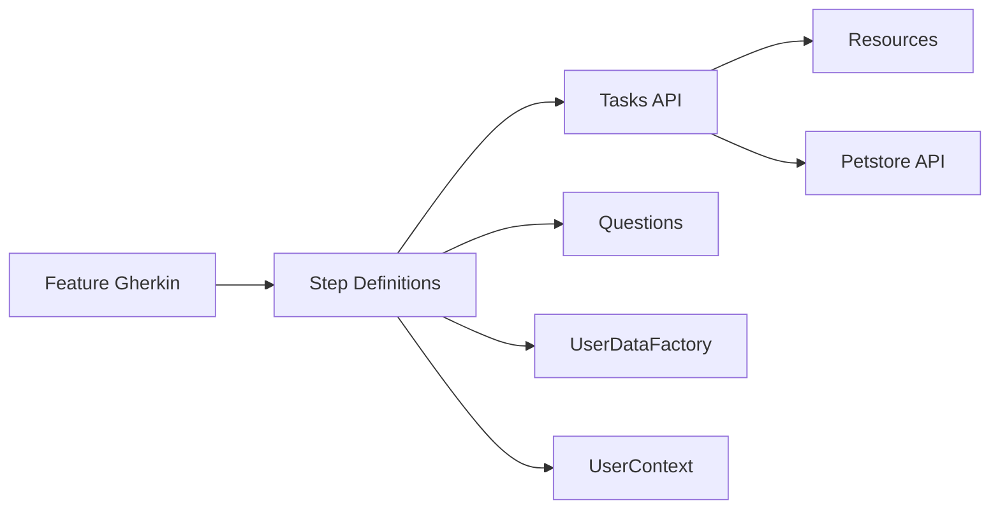
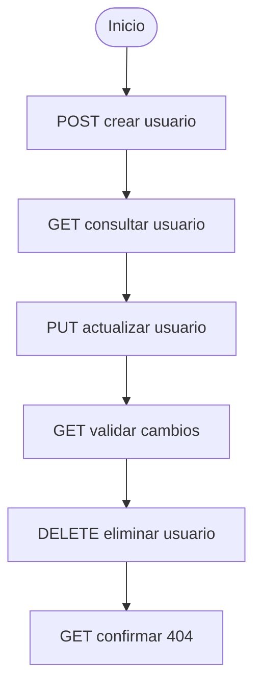

# AUTO_API_PETSTORE_SCREENPLAY

Automatizacion API con patron Screenplay para el ciclo CRUD de usuarios en Swagger Petstore.

## Stack

- Java 11
- Gradle
- Serenity BDD + Screenplay
- Cucumber (Gherkin)
- Serenity Rest / Rest Assured
- Lombok

## Arquitectura actual



## Estructura principal

```text
src/test/java/co/com/petstore/
|-- hooks/            # Setup y teardown del actor
|-- models/           # POJOs de request/response
|-- questions/        # Lectura y validacion de respuesta
|-- runners/          # Runner JUnit Platform + Cucumber
|-- stepdefinitions/  # Pasos Given/When/Then
|-- tasks/            # Interacciones REST (POST/GET/PUT/DELETE)
`-- utils/            # Constantes, recursos, contexto y fabrica de datos

src/test/resources/
|-- features/         # Escenarios BDD
`-- serenity.conf     # Configuracion Serenity y RestAssured
```

## Refactor aplicado

- Se encapsulo `UserContext` para evitar estado publico mutable.
- Se agrego `UserDataFactory` para centralizar la construccion de usuarios base y actualizados.
- Se eliminaron duplicaciones de validacion de status en Step Definitions.
- Se unifico la key de path param `username` en una constante reutilizable.
- Se mantuvo el flujo CRUD intacto con mejor legibilidad y mantenibilidad.

## Flujo CRUD validado



## Ejecucion

1. Verificar Java:

```bash
java -version
```

2. Ejecutar pruebas y consolidar reporte:

```bash
./gradlew clean test aggregate
```

3. Ejecutar flujo completo y abrir reporte:

```bash
./gradlew serenityReport
```

En Windows tambien puedes usar:

```bat
gradlew.bat clean test aggregate
gradlew.bat serenityReport
```

## Tag de ejecucion

- El runner actual ejecuta escenarios con tag `@regresion`.
